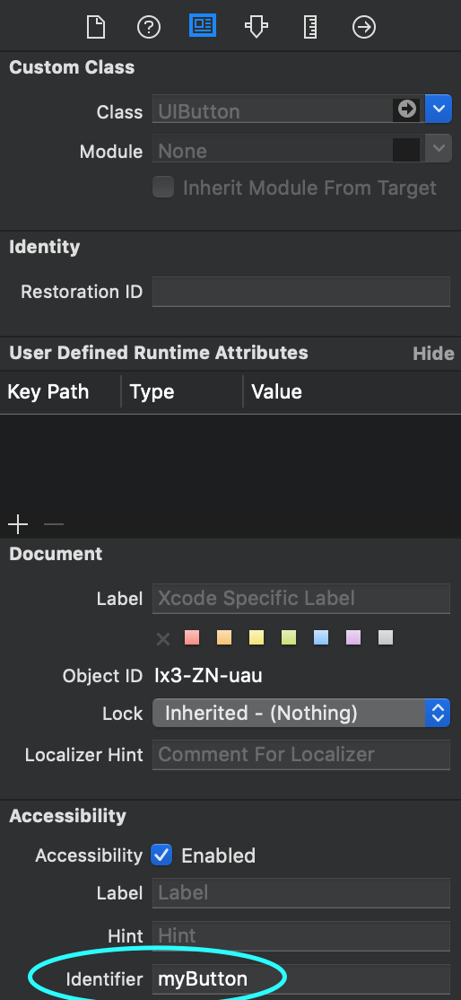

# xName

[](https://travis-ci.org/muhsinfatih@gmail.com/xName)
[](https://cocoapods.org/pods/xName)
[](https://cocoapods.org/pods/xName)
[](https://cocoapods.org/pods/xName)


## Usage

```swift
    var views: [String: UIView] = [:]
    override func viewDidLoad() {
        ...
        views = self.view.viewsWithId() // load subviews with accessibility id

        let myButton = views["myButton"] as? UIButton // fun!
        myButton?.tintColor = .green
    }
```
create a UIButton and set its accessibility identifier (under identity inspector) to "myButton"  



## Example

To run the example project, clone the repo, and run `pod install` from the Example directory first.

## Requirements
none
## Installation

xName is available through [CocoaPods](https://cocoapods.org). To install
it, simply add the following line to your Podfile:

```ruby
pod 'xName'
```

## Author

Muhsin Fatih Yorulmaz, muhsinfatih@gmail.com

## License

xName is available under the MIT license. See the LICENSE file for more info.
